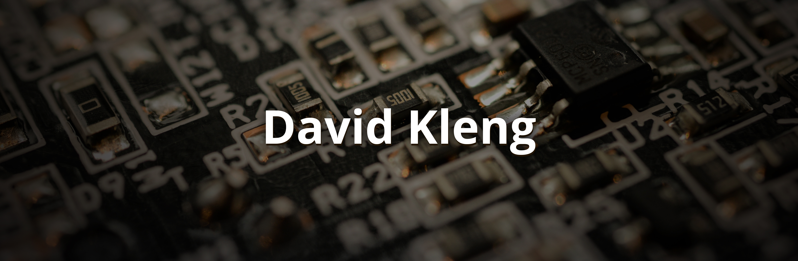

  

### Hi, I'm David!
I'm in electronics and programming. Also, i'm an Electronics Engineering student.

You can see my <a href="https://davidkleng.com.ar">Website</a>
or my <a href="https://www.linkedin.com/in/davidkleng/">Linkedin</a>

I'm currently working at <a href="https://autosolve.com.ar/#/">AutoSolve</a>, programming microcontrollers and making PCBs. 

<!--
**davidkleng/davidkleng** is a ✨ _special_ ✨ repository because its `README.md` (this file) appears on your GitHub profile.

Here are some ideas to get you started:

- 🔭 I’m currently working on ...
- 🌱 I’m currently learning ...
- 👯 I’m looking to collaborate on ...
- 🤔 I’m looking for help with ...
- 💬 Ask me about ...
- 📫 How to reach me: ...
- 😄 Pronouns: ...
- ⚡ Fun fact: ...
-->
